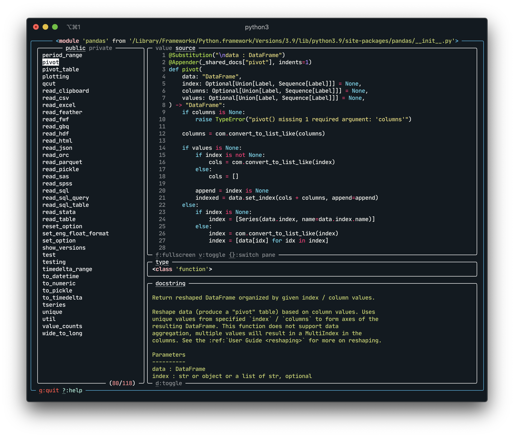

# Object
An Interactive Python Object Explorer




## Install

TODO 
```
pip install objexplore
```

```
pip install git+https://github.com/kylepollina/objexplore
```

## Usage

```python
from objexplore import explore
import pandas
explore(pandas)
```
