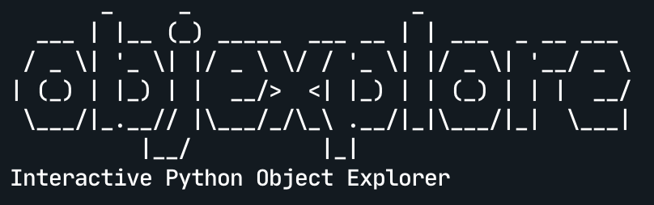

Objexplore is an interactive Python object explorer for the terminal. Use it while debugging, or exploring a new library, or whatever!

 [](https://pypi.org/project/objexplore/) [](https://img.shields.io/pypi/dm/objexplore)

https://user-images.githubusercontent.com/13981456/134041697-27f55c44-1075-4139-826c-bad6f0d6bffb.mov


## Install

```
pip install objexplore
```

or

```
pip install git+https://github.com/kylepollina/objexplore
```

## Usage

```python
from objexplore import explore
import rich
explore(rich)
```

## Features

- [Exploring](#exploring)
- [Type filters](#type-filters)
- [Search filters](#search-filters)
- [Stack view](#stack-view)
- [Exploring and returning](#exploring-and-returning)


### Exploring


https://user-images.githubusercontent.com/13981456/133946740-7bbb2039-24ce-41a8-9589-0888918f9bd8.mov


### Type Filters

https://user-images.githubusercontent.com/13981456/133946565-ae2f9809-b724-4439-b5c5-13b77c3be8f6.mov

### Search Filters

https://user-images.githubusercontent.com/13981456/133953511-6b19a7f0-7cd1-4b2f-9842-5f7d4c59efae.mov


### Stack view

https://user-images.githubusercontent.com/13981456/133947144-dbed8d99-1ae8-4e50-a414-2a3b03311327.mov


### Exploring and returning


https://user-images.githubusercontent.com/13981456/133946981-3bf5cfda-6eac-4514-abb3-e073dd3fb6b2.mov

### Open source file in `$EDITOR`


https://user-images.githubusercontent.com/13981456/134768632-1d3d22a8-7554-4085-b25b-94fee2528df4.mov


-----

Built with the amazing [rich](https://github.com/willmcgugan/rich) and [blessed](https://github.com/jquast/blessed) packages. Check them out!


## Contributing
Read [CONTRIBUTING.md](CONTRIBUTING.md)

------

[LICENSE](LICENSE)
